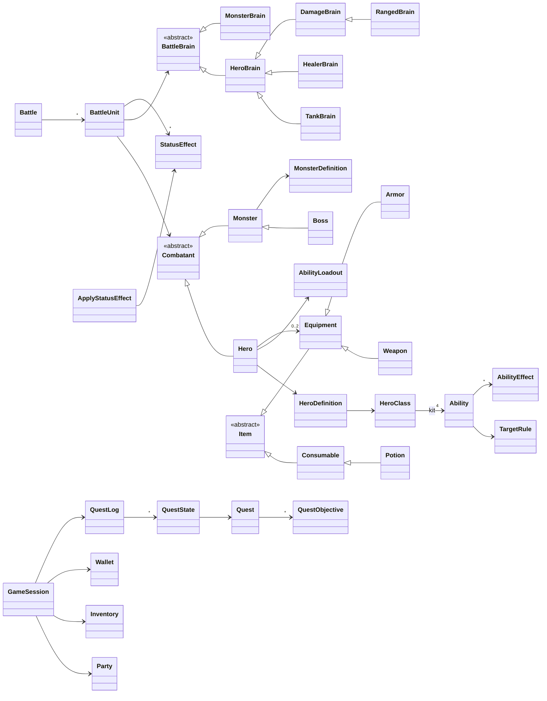
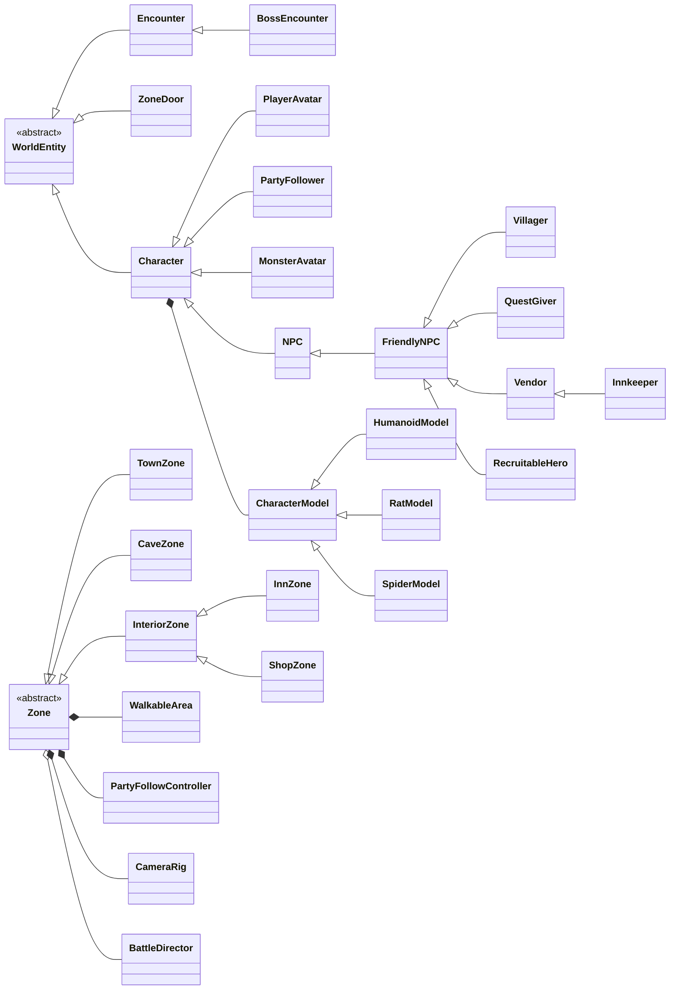

# Domain Model — RPG Auto Battler (working title)

This document defines **every object in the game world**, what it is responsible for, and how
it inherits from or composes other objects. It is the source of truth for the codebase: every
class listed here exists under `src/` with the same name (`class_name`).

---

## 1. Layers

The game is split into four layers. Dependencies only point **downwards**.

```
┌──────────────────────────────────────────────────────────────────────────┐
│  UI layer            src/ui/        Windows, HUDs, widgets (Control)     │
├──────────────────────────────────────────────────────────────────────────┤
│  Presentation layer  src/world/     Zones, entities, 3D models (Node3D)  │
│                      src/battle/    Battle presentation (views, VFX)     │
├──────────────────────────────────────────────────────────────────────────┤
│  Services            src/autoload/  GameState, Content, UI, SceneRouter… │
├──────────────────────────────────────────────────────────────────────────┤
│  Domain layer        src/domain/    Pure rules & data (Resource/RefCnt)  │
│  Content             src/content/   Catalogs that author domain data     │
└──────────────────────────────────────────────────────────────────────────┘
```

* **Domain** objects never touch nodes, scenes or the renderer. The whole combat system can run
  headless (`tests/battle_sim.gd` simulates hundreds of battles in about a second).
* **Definitions vs runtime state**: immutable, shareable data is a `Resource` (`HeroClass`,
  `Ability`, `Item`, `Quest`…). Mutable per-playthrough state is a `RefCounted`
  (`Hero`, `BattleUnit`, `QuestState`, `Inventory`…).
* **Presentation observes the domain through signals.** `CombatUnitView` listens to
  `BattleUnit.damaged`; the domain never calls a view.

---

## 2. World entity hierarchy (things placed in a Zone)

The chain the brief asked for (`Character → NPC → FriendlyNPC → Vendor`) is implemented as follows:

```
Node3D
└── WorldEntity                    (abstract) id, name, Interactable protocol
    ├── Character                  (abstract) CharacterModel, walking, facing
    │   ├── PlayerAvatar           the Wayfarer you steer (keyboard / click-to-move)
    │   ├── PartyFollower          overworld body of a recruited Hero, trails the player
    │   ├── MonsterAvatar          enemy standing inside an Encounter
    │   └── NPC                    (abstract) appearance, nameplate, speech bubbles
    │       └── FriendlyNPC        conversation + greeting; hook _add_options()
    │           ├── Villager       wanders around home, barks when you pass
    │           ├── QuestGiver     offers/turns in quest chains, floating ! and ? marker
    │           ├── Vendor         sells stock, buys anything back
    │           │   └── Innkeeper  Vendor + "Rest for the night" (full party heal)
    │           └── RecruitableHero  tavern hero who joins the party
    ├── ZoneDoor                   portal to another zone (doors, cave mouth, exits)
    └── Encounter                  monster pack; entering its radius starts a battle
        └── BossEncounter          boss shouts an intro, you choose to engage
```

### The Interactable protocol
GDScript has single inheritance, and `NPC` (a Character) and `ZoneDoor` (not a Character) both need
to be interactable. Instead of a fake second base class, `WorldEntity` declares the protocol as
**template methods** that default to "not interactable":

| Method | Purpose |
|---|---|
| `is_interactable()` | opt-in flag (NPC, ZoneDoor return `true`) |
| `can_interact()` | runtime availability (visible, not busy) |
| `get_interaction_radius()` | how close the player must be |
| `get_interaction_verb()` / `get_interaction_prompt()` | text for the HUD prompt "[E] Talk to Elder Maren" |
| `interact(player)` | the action |

Interactable entities join the `interactable` group; `PlayerAvatar` focuses the nearest one.

### Visual models (composition, not inheritance)
A `Character` **has a** `CharacterModel`, built by `ModelFactory` from a data-only `Appearance`:

```
Node3D
└── CharacterModel         (abstract) shared procedural animation: idle, walk, lunge, hit, death
    ├── HumanoidModel      chibi person: outfit, headgear and prop all driven by Appearance
    ├── RatModel
    └── SpiderModel
```

The same model classes render the overworld, the battles, the title screen and the portraits.

### Zones

```
Node3D
└── Zone                   (abstract) template method: environment → world → spawn party
    ├── TownZone           Oakhaven Village
    ├── CaveZone           Glimmerdeep Cave (4 chambers, generated walls)
    └── InteriorZone       (abstract) plank floor, 3 walls, exit door, warm light
        ├── InnZone        The Sleepy Griffin Inn
        └── ShopZone       Tilda's Wares
```

Zone helpers (composition): `WalkableArea` (navigation bounds), `CameraRig`,
`PartyFollowController` (breadcrumb trail for the 5 followers), `BattleDirector` (while fighting).

---

## 3. Combat domain

### 3.1 Combatants — who fights

```
RefCounted
└── Combatant              (abstract) name, current HP, stats, abilities, brain factory
    ├── Hero               level, XP, skill points, equipment, AbilityLoadout
    └── Monster            created from a MonsterDefinition for one fight
        └── Boss           phases: becomes Enraged below a HP threshold, immune to stuns
```

`Combatant` is **persistent** (hero HP carries between encounters). Everything that only exists
during a fight lives in a **`BattleUnit`** wrapper:

```
BattleUnit (RefCounted)
  combatant: Combatant        ← persistent identity & HP
  brain: BattleBrain          ← decision maker
  statuses: [StatusEffect]    ← buffs / debuffs
  recovery_* (action bar)     ← the bar under the health bar
  cast_* (cast bar)           ← channelled spells, interruptible
  cooldowns{Ability: secs}
  focus: BattleUnit           ← who it is attacking
```

`Battle` owns two teams of `BattleUnit`s and the clock. It is deterministic for a given seed.

### 3.2 Abilities — composed, not subclassed

An `Ability` is **data**: one `TargetRule` + a list of `AbilityEffect`s + timing numbers.
New abilities never need new classes. Its AI value is the sum of its effects' values.

```
Resource
├── Ability                cooldown, recovery, cast_time, interruptible, delivery, tags
├── TargetRule             (abstract strategy) "who does this hit?"
│   ├── FocusEnemyRule         the enemy the brain is focusing (respects taunts)
│   ├── CastingEnemyRule       an enemy mid-cast (optionally falls back to focus)
│   ├── AllEnemiesRule
│   ├── AllAlliesRule
│   ├── SelfRule
│   ├── LowestHealthAllyRule
│   └── MostThreatenedAllyRule the ally most enemies are hitting
├── AbilityEffect          (abstract strategy) "what happens to each target?" + evaluate()
│   ├── DamageEffect
│   ├── HealEffect
│   ├── InterruptEffect
│   └── ApplyStatusEffect      applies a copy of a StatusEffect template
└── StatusEffect           (abstract, template methods: tick, modify_stats, modify_incoming_damage…)
    ├── ShieldStatus           absorbs damage
    ├── DamageOverTimeStatus   poison / burn
    ├── HealOverTimeStatus     renew
    ├── StunStatus             cannot act, breaks casts
    ├── TauntStatus            forced target
    └── StatModifierStatus     power / haste / damage-taken multipliers (buffs, enrage)
```

Example — Warrior **Shield Slam** = `CastingEnemyRule(fallback)` + `[DamageEffect(1.3), InterruptEffect]`.
Example — Priest **Holy Ward** = `MostThreatenedAllyRule` + `[ApplyStatusEffect(ShieldStatus 2.2x, 8s)]`.

### 3.3 Brains — the per-role decision tree

```
RefCounted
└── BattleBrain            (abstract) utility scoring loop + focus selection
    ├── HeroBrain          honours the player's ability order; team focus fire
    │   ├── TankBrain      Taunt ×2.4, Defensive ×1.8, Interrupt ×1.6, peels enemies off allies
    │   ├── HealerBrain    Heal ×3.0, Defensive ×1.6, Damage ×0.6
    │   └── DamageBrain    Interrupt ×2.0, Damage ×1.2, AoE ×1.25 (melee DPS)
    │       └── RangedBrain    back line; snipes enemy healers/casters first
    └── MonsterBrain       sticky targets, prefers the front line, switches 12% of the time
```

For every usable ability:
**score = utility (situation) × role bias (tags) × player preference (list order)**.
The best score wins; the basic attack is the fallback. The heavy biases give each role its personality
(tanks tank, healers heal, DPS deal damage and interrupt) while the same code serves all of them.
`HeroClass.create_brain()` is the factory that picks a brain from the class's `Role`.

### 3.4 Supporting combat types

| Type | Kind | Role |
|---|---|---|
| `CombatTypes` | static | enums: `Team`, `Role`, `School`, `Tag`, `Delivery` |
| `StatBlock` | Resource | max_hp, power, armor, haste, crit; returns new blocks from `plus()` and `times()` |
| `BattleAction` | RefCounted | a brain's decision (ability, targets, score) |
| `AbilityLoadout` | RefCounted | per-hero ordered list of abilities with enabled flags |

---

## 4. Characters & progression

| Class | Kind | Responsibility |
|---|---|---|
| `HeroClass` | Resource | Warrior / Priest / Hunter / Mage: role, base stats, growth per level, basic attack, 4-ability kit, allowed weapon/armour types, brain factory |
| `HeroDefinition` | Resource | a specific recruitable character (Garrick, Seraphine…): class, look, bio, starting gear |
| `Hero` | Combatant | runtime hero: `level`, `xp`, `skill_points`, `equip()/unequip()`, `unlock(ability)`, `loadout` |
| `MonsterDefinition` | Resource | enemy stats, abilities, look, rewards, boss settings; `spawn()` factory → `Monster` or `Boss` |
| `EncounterDefinition` | Resource | a fight: monster list, bonus gold, loot, boss intro line |
| `Appearance` | Resource | body type, outfit, headgear, prop, colours, scale (interpreted by `ModelFactory`) |
| `Party` | RefCounted | roster (max 5), recruit, restore, average level |
| `Wallet` | RefCounted | gold |
| `RewardReport` | RefCounted | XP / gold / items / level-ups from a battle or quest |
| `GameSession` | RefCounted | **aggregate root** of a playthrough: party, inventory, wallet, quest log, cleared encounters |

Levelling: `XP_PER_LEVEL × level` to reach the next level; +1 skill point per level. Ability #1 of each
kit is free, the rest cost 1 skill point each and have minimum levels (1, 1, 2, 3).

---

## 5. Items

```
Resource
└── Item                   (abstract) id, name, price, rarity, icon, tooltip
    ├── Consumable         (abstract) stackable; can_use_on(hero) / use_on(hero)
    │   └── Potion         heals flat + % max HP; auto-drunk in battle below 30% HP
    └── Equipment          (abstract) StatBlock bonus, level requirement, get_slot()
        ├── Weapon         WeaponType: Sword, Mace, Staff, Bow, Wand   (slot WEAPON)
        └── Armor          ArmorType: Cloth, Leather, Plate           (slot ARMOR)
```

`Inventory` (RefCounted) holds `Inventory.Entry` (item + quantity) and merges stackables.
Equip rules are polymorphic: `Weapon.can_be_equipped_by(hero)` checks the class's weapon types,
then defers to `Equipment` for the level requirement.

---

## 6. Quests & narrative

```
Resource
├── Quest                  title, texts, giver, prerequisite, objectives, rewards
└── QuestObjective         (abstract) advance(event, progress) -> new progress
    ├── TalkObjective          speak with an NPC
    ├── ClearEncounterObjective  win a specific encounter
    ├── PartySizeObjective     have N heroes (absolute value, retro-applied on accept)
    └── PurchaseObjective      buy a specific item

RefCounted
├── QuestState             runtime progress + status (ACTIVE → READY_TO_TURN_IN → COMPLETED)
├── QuestLog               offering rules, accept, event routing, completion
├── GameEvent              {type, subject, amount}: NPC_TALKED, ENCOUNTER_CLEARED, HERO_RECRUITED, ITEM_PURCHASED
└── Dialogue               speaker, pages, options (Dialogue.Option: label + Callable)
```

World code publishes `GameEvent`s through `GameState.publish()`; the `QuestLog` routes them to
objectives. Nothing in the world knows which quests exist (Observer pattern).

---

## 7. Services (autoload singletons)

| Autoload | Responsibility |
|---|---|
| `EventBus` | global UI-facing signals: toasts, dialogue/shop requests, interaction focus |
| `Content` | read-only registry of every definition, looked up by id |
| `GameState` | owns the `GameSession` and the input-mode stack (MENU, EXPLORE, DIALOGUE, WINDOW, BATTLE, TRANSITION); single entry point for recruit/buy/sell/rest/rewards |
| `Portraits` | renders hero/NPC busts from their real 3D models into cached textures |
| `UI` | facade over every screen widget: HUD, battle HUD, dialogue, windows, toasts |
| `SceneRouter` | all scene changes, behind the loading screen, with threaded loading |

---

## 8. Presentation & UI classes

```
Node
└── BattleDirector         orchestrates one in-place battle: pre-battle → entry → tick → rewards
Node3D
└── CombatUnitView         animates a BattleUnit (lunges, projectiles, numbers, statuses)

Control
├── UiWindow               (abstract) modal parchment window
│   ├── PartyWindow        stats, equipment, skill points, loadout editor
│   ├── InventoryWindow    use potions, equip gear
│   ├── QuestWindow        journal
│   ├── ShopWindow         buy / sell
│   ├── PreBattleWindow    enemy preview + per-hero ability ordering, Fight / Retreat
│   ├── BattleResultWindow victory/defeat, loot, level-ups
│   └── PauseWindow        controls, title screen, quit
├── Hud                    party frames, gold, quest tracker, menu buttons, prompt, zone title card
├── BattleHud              unit plates, hero cards, speed toggle, announcements
├── UnitPlate              floating HP bar + action bar + cast bar over a combatant
├── DialogueBox            typewriter conversation with portrait and choices
├── LoadingScreen          destination title, tip, progress bar
├── Bar / IconGlyph / Portrait     drawn widgets (no image assets)
├── ItemSlot / AbilityIcon (PanelContainer)
├── LoadoutEditor (BoxContainer)   shared by PartyWindow and PreBattleWindow
└── ToastStack (VBoxContainer)
```

Static helpers (no state): `UiKit` (palette, theme, widget constructors), `LowPoly` (faceted
mesh and material factory), `Props` / `Terrain` (scenery builders), `ModelFactory`, `Vfx`,
`Controls`, and the content catalogs (`ClassCatalog`, `ItemCatalog`, `HeroCatalog`,
`MonsterCatalog`, `QuestCatalog`, `ContentKit`).

---

## 9. Class diagram (core domain)




